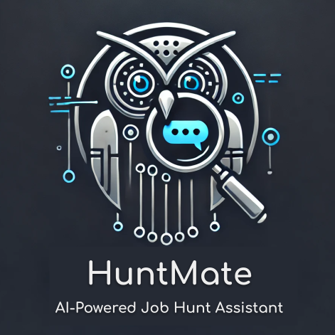
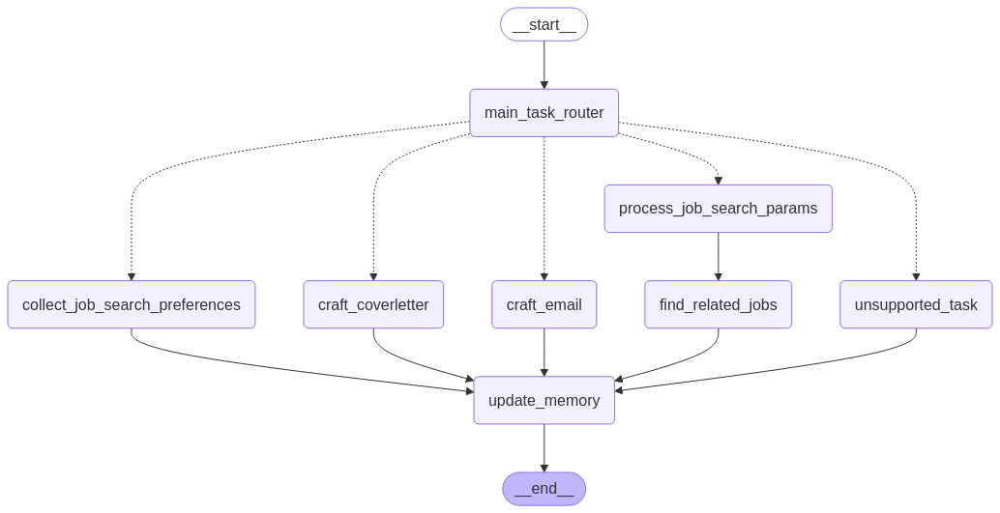

# HuntMate

<div align="center">
    <br>
    <br><br>
</div>

The idea for this repo came from my frustration with job searching—many times, I feel like I need to talk directly to LinkedIn and explain exactly what I want (and don’t want) in a job search.

Too often, I find myself overwhelmed by the amount of manual work required to find relevant job postings, filter through them, and apply. It’s time-consuming, repetitive, and, honestly, exhausting.

So, I decided to build HuntMate—an AI-powered job search assistant—to make my own job hunt easier and, hopefully, help others too!

Since a true mate should be able to handle a variety of requests, HuntMate is an **LLM agent** at its core, powered by `GPT-4o-mini`. However, you can swap out the LLM with any model of your choice.

🛠️ Development is currently in progress, and I would appreciate any sort of insights or suggestions!
Here’s an overview of the current LLM agent workflow:

<div align="center">
    <br>
    <br><br>
</div>


## Configuration Instructions

#### 1. Install Dependencies using uv

You can install uv (if not already installed) using the following method:

```bash
pip install uv
```

Next, create the virtual environment and install dependencies:

```bash
uv venv
source .venv/bin/activate  # On Windows: .venv\Scripts\activate
uv sync
```


#### 2. Config `api.cfg`

Update `api.cfg.example` with your username, password, and API keys, then rename it to `api.cfg`.

## Run HuntMate

To launch the app, run the following command in your terminal:

```bash
streamlit run app.py
```

The application defaults to using `gpt-4o-mini` as its language model. However, you can select a different LLM since the application utilizes LiteLLM for model integration.
Note that the application requires a model with structured-output capabilities. 
To specify a different model, use:

```bash
streamlit run app.py -- --model_name="gpt-4o"
```
