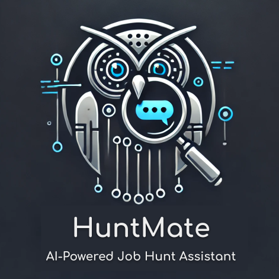

# HuntMate

<div align="center">
    <br>
    <br><br>
</div>

The idea for this repo came from my frustration with job searching—many times, I feel like I need to talk directly to LinkedIn and explain exactly what I want (and don’t want) in a job search.

Too often, I find myself overwhelmed by the amount of manual work required to find relevant job postings, filter through them, and apply. It’s time-consuming, repetitive, and, honestly, exhausting.

So, I decided to build HuntMate—an AI-powered job search assistant—to make my own job hunt easier and, hopefully, help others too!

Since a true mate should be able to handle a variety of requests, HuntMate is an **LLM agent** at its core, powered by `GPT-4o-mini`. However, you can swap out the LLM with any model of your choice.

🛠️ Development is currently in progress, and I'm aiming to release the first version by the end of February. Keep an eye out for updates!

## Configuration Instructions

#### 1. Create a virtual environment and install the dependencies

```bash
python -m venv env
source env/bin/activate
pip install -r requirements.txt 
```

#### 2. Config `api.cfg`

change the `api.cfg.example` and add your own username, password and API keys, and rename the file to `api.cfg`.

## Runnig HuntMate

To run this app, open your terminal and run:

```bash
streamlit run app.py
```
